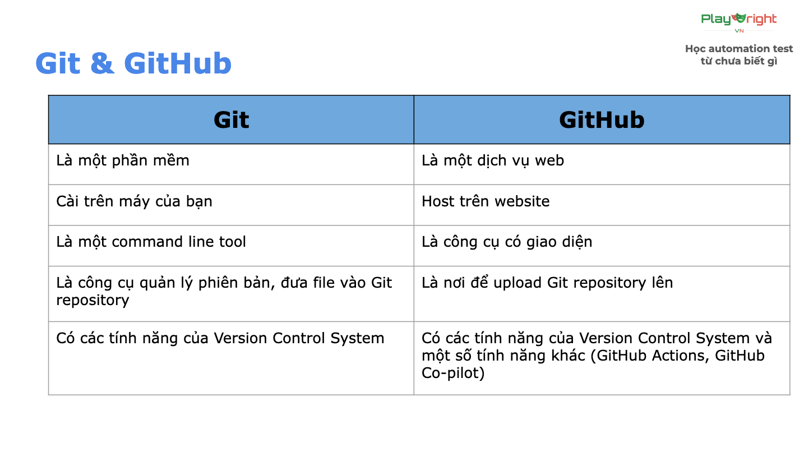

# GIT

## Version Control System - Git

## 3 States

- **Working Directory**: Các files mới hoặc files có thay đổi
- **Staging Area**: Các files đưa vào vùng chuẩn bị commit (tạo ra các phiên bản)
- **Repository**: Các commits (phiên bản) 

tổng kết: 

- Khởi tạo repo local: **git init**

- Liên kết repository vừa tạo với Git: **git remote add origin <ssh_link>**

- Thêm code: **git add .**

- Thêm commit: **git commit -m”init project”**

- Push code: **git push origin main**

- Xem trạng thái files: **git status**

- Check commit list: **git log**

## Git - commit convention (Quy tắc)

Cấu trúc: **`<type>: <short_description>`**

Trong đó:

- type: loại commit
  - **chore:** sửa nhỏ lẻ, chính tả, xóa file không dùng tới,...
  - **feat:** thêm tính năng mới, test case mới
  - **fix:** sửa lỗi 1 test trước đó
- short_description: mô tả ngắn gọn (50 kí tự), tiếng Anh hoặc tiếng Việt không dấu.

